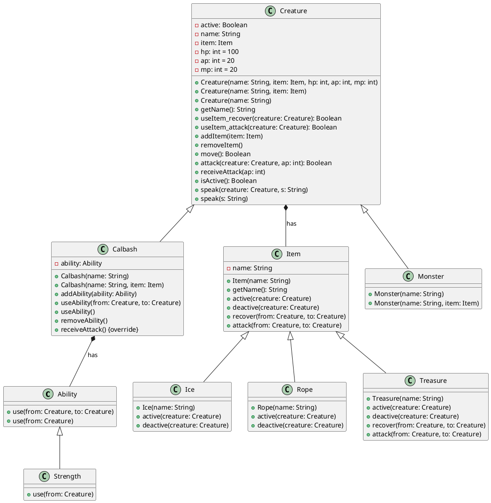

## plantuml

### 类图

- 
  - 内部类：`Line +-- Position`
  - 可以用`..` 来代替`--` ，会显示为虚线。
  - 在关系之间使用标签来说明时, 使用 `:`后接 标签文字。
  
- 
  - 通过修饰符`{static}`或者`{abstract}`，可以定义静态或者抽象的方法或者属性。
- 



### 时序图

- **实线（Solid Line）**：(->)实线用于表示同步消息或普通消息的传递。它表示消息的接收者在接收到消息后会暂停执行，并等待发送者执行完毕。在时序图中，通常使用实线来表示一般的消息传递。
- **虚线（Dashed Line）**：(-->)虚线通常用于表示异步消息或返回消息。异步消息表示消息的接收者在接收到消息后不会立即暂停执行，而是继续执行其他操作，而不等待发送者执行完毕。返回消息表示消息的接收者已经完成了某个操作，并将结果返回给发送者。在时序图中，通常使用虚线来表示这些异步或返回消息。

- 

```plantuml

@startuml
//设置人物
actor       老头   as oldman
actor       蛇精    as snake  #Black
actor       蝎子精    as scorpion   #Purple
entity      蛛网  as spiderweb #White
//箭头，方向及内容
spiderweb -[#Green]> spiderweb : 开

snake -[#Grey]> oldman : 告诉
//note表示更多信息
note right
    老人家，
    你和我无冤无仇，
    这次请你来...
end note

oldman -[#Grey]> snake : 告诉
note left: 哼!有这么请的么？

snake -[#Grey]> oldman : 告诉
note right
    老人家，冤仇易解不宜结，
    我们攀个亲家交个朋友，
    你可以安度晚年
end note

scorpion -[#Grey]> oldman : 告诉
note right
    这是我们的一片诚意啊！
    哈哈哈哈哈哈哈...
end note

snake -[#Grey]> oldman : 告诉
note right: 来来来，我先敬你一杯

oldman -[#Grey]> snake : 告诉
note left: 去你的

oldman -[#Red]> snake : 造成伤害
note left: 掌掴

scorpion -[#Blue]> scorpion : 发怒
note right: 哇呀呀呀呀呀...

scorpion -[#Blue]> scorpion : 前进

scorpion -[#Grey]> oldman : 告诉

note right: 你是不想活了你

scorpion -[#Red]> oldman : 造成伤害
note left: 掐

snake -[#Grey]> scorpion : 告诉
note right
    大王，别急，
    留着这老头才能摸清葫芦的奥秘，
    知己知彼才能消灾灭祸
end note

scorpion -[#Blue]> scorpion : 转眼珠

spiderweb -[#Green]> spiderweb : 关

@enduml


```

```
@startuml

actor User

User -> Scene: main()

activate Scene
Scene -> Line: Line line = new Line(7)

activate Line
Scene -> Line: line.put(Gourd.ONE, 6)
Scene -> Line: line.put(Gourd.TWO, 3)
Scene -> Line: line.put(Gourd.THREE, 1)
Scene -> Line: line.put(Gourd.FOUR, 5)
Scene -> Line: line.put(Gourd.FIVE, 2)
Scene -> Line: line.put(Gourd.SIX, 4)
Scene -> Line: line.put(Gourd.SEVEN, 0)

User -> Geezer: theGeezer = Geezer.getTheGeezer()

activate Geezer
Geezer -> Geezer: private constructor()

User -> Sorter: sorter = new BubbleSorter()

activate Sorter
Sorter -> Sorter: private constructor()

Geezer -> Geezer: void setSorter(Sorter sorter)
Geezer -> Geezer: String lineUp(Line line)

Sorter -> Sorter: void load(int[] elements)
Sorter -> Sorter: void sort()
Sorter -> Sorter: String getPlan()

Geezer --> Sorter: Sorter sorter
Geezer --> Line: Line line

Sorter --> Geezer: String plan

Geezer --> Geezer: void execute(String step)

User -> FileWriter: writer = new BufferedWriter(new FileWriter("result.txt"))
activate FileWriter
User --> User: Write log to file

User -> FileWriter: writer.write(log)
User -> FileWriter: writer.flush()
User -> FileWriter: writer.close()

deactivate Geezer
deactivate Sorter
deactivate FileWriter
deactivate Line
deactivate Scene

@enduml

```

